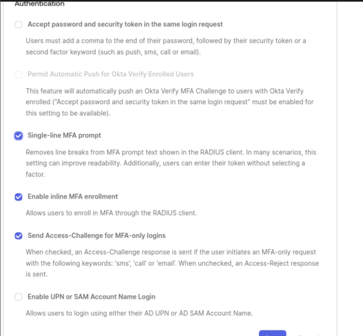

# StrongSwan IkeV2 VPN Access Gateway, User Pubkey & Okta Authentication
This repository provides scripts and instructions to configure and manage a StrongSwan IkeV2 VPN Gateway with Suricata IDS. It includes a dynamic Python script to manage and blacklist traffic. Syslog-ng is auto-configured to forward logs to a syslog server. IPsec client authentication supports both public key (Pubkey) and Okta authentication.

The server is configured to operate within a NAT environment on a Virtual Machine. If you plan to expose the server directly to the internet, update nftables accordingly. SSH and Cockpit are enabled on the public chain; you may want to disable Cockpit.<br>
**Note**: This setup is designed for a single-interface VM to automatically configure a VPN Gateway using UDP ports 4500 and 500, ESP protocol 50, and TCP port 80.<br>

**Important**: Ensure you have an SSH key installed for SSH access before starting the installation.

## Prerequisites

- **Operating System**: Debian 12+
- **CPU**: 2-12 cores
- **Memory**: 2 GB RAM or more
- **Storage**: 15 GB HDD

## Installation

Before starting the installation, set your system's hostname:

> Note: The above specifications are for the base system. If you plan to use IPS, additional resources will be required.

```bash
sudo hostnamectl set-hostname hostname.example.com
```

```bash
sudo apt-get install git -y && sudo apt-get update -y && git clone https://github.com/unsupervised-adult/strongconn && cd ./strongconn && chmod +x ./strongconn.sh ./ikpki.sh ./tunnel.sh && sudo ./strongconn.sh -install
```

When the installer begins, it will ask for the routing mode. You have three options:


Once the client routing mode is selected, an editor will open the configuration file. Edit the variables to match your environment. Ensure all required fields are filled in and avoid changing certificate directories as it is untested **caution!**. Once you have finished editing, save and the installer will then ask you to confirm the config.

Replace the placeholders with your specific values:

The VPN setup will compile StrongSwan, configure the firewall, set up OSPF to manage routing, Suricata IDS & syslog-ng .


After the main VPN setup is complete, the system will proceed to harden the installation.

The hardening process includes:
- Adding rkhunter cron jobs for regular rootkit checks
- Starting and enabling process accounting
- Installing and enforcing AppArmor
- Configuring core dump settings to prevent core dumps
- Setting a default umask to 027
- Configuring password hashing rounds for stronger password security
- Installing and configuring the PAM module for password strength testing
- Setting a minimum password age
- Installing and configuring system update tools
- Enabling unattended security updates
- Purging old/removed packages
- Installing and enabling sysstat for system performance monitoring
- Installing and configuring auditd for system auditing
- Blacklisting unnecessary protocols like USB
- Disabling firewire modules if not needed
- Updating initramfs to apply module blacklists and other changes
- Installing and configuring AIDE for file integrity monitoring
- Configuring the SSH daemon for secure access
- Installing and configuring Fail2Ban on SSH
- Setting basic legal banners for unauthorized access warnings
- Configuring debsums for regular integrity checks
- Restricting compiler usage to root only
- Applying additional sysctl hardening settings
- Configuring a GRUB password for bootloader protection

## Post-Installation Steps

The installer log can be found at /var/logs/strongconn.log

### Managing Certificates

Use the `ikpki.sh` helper script to manage certificates:

- **Revoke certificates**
- **List certificates**
- **Generate client certificates**

Generate and List Client Certificates:

This example demonstrates generating a client certificate with a 3-month expiration (the maximum allowed expiration is 120 months):

```bash
sudo ikpki.sh generate-client bob.ding@unexample.foo 32
```

Importing CSV of users for pubkey format is name first column validity integer second column:

```bash
sudo ikpki.sh import-csv /path/to.csv
```

Listing Certificates:

```bash
sudo ikpki.sh list
```


Revoking a user certificate is done with the revoke command plus name/path and reason as a number or menu to select:

```bash
sudo ikpki.sh generate-crl revoke name/cert path reason number 1-5
```


This is run every 17 days via cron job to get CRL valid. Use this after any revocations or adding a series of users. This will restart the responder also:

```bash
sudo ikpki.sh generate-crl full
```

Set permissions with parse through /opt/pki and /etc/swanctl and fix any missing symlinks and ACL to files and folders:

```bash
sudo ikpki.sh set-permissions
```


Rebuilds index.txt searching for certs signed by CA. You will need to revoke certificates if any have been again and do a full CRL update:

```bash
sudo ikpki.sh rebuild-crl
```

### Install and Configure the Okta RADIUS Agent

Ensure that the RSA SSL Key and certificate are installed, and the Okta RADIUS agent is configured with EAP-TTLS enabled using the same RSA TLS certificate as the server.

You can install the testing certificate generated by `ikpki.sh`. The DNS self-signed certificate is located in `/root/dnsname.tar.gz`.

**Note**: If you use the `ikpki.sh` TLS certificate, you will need to manually accept the certificate on the client side and install the CA into the certificate store. This is not secure and should not be used in a production environment. The Pubkey authentication certificate is generated with an IP for its ID & SAN , while the custom server certificate is generated with the FQDN as the ID & SAN . Okta clients use FQDN, while Pubkey uses IP for the remote ID/server address. The custom test certificate is generated during installation and is available in a tar file in `/root`.

Generate a Server Certificate for StrongSwan with the DNS name in CN and SAN:

```bash
sudo ikpki.sh generate-custom-server
```

#### Generate a CSR request for TLS OKTA auth:

```bash
sudo ikpki.sh generate-csr
```
After testing with a self-signed certificate, you can generate a Certificate Signing Request (CSR) with the Extended Key Usage (EKU) for server authentication. This CSR can then be signed by a third-party Certificate Authority (CA) for an RSA certificate. While StrongSwan supports EC certificates and Let's Encrypt, the Okta app currently does not seem to work with these options. If you manage to get it working, please share!

### Switch Configuration Modes

To switch between configuration modes (e.g., Okta or both), use the following command:

```bash
sudo strongconn.sh switch-config okta|pubkey|both
```

Copy the (RSA) TLS Certificate and Key:

Copy and name the RSA TLS certificate to /etc/swanctl/x509:

```bash
/etc/swanctl/x509/${DNS_NAME}.${DNS}.server.pem
```

Copy & name the RSA private key to /etc/swanctl/private:

```bash
/etc/swanctl/private/${DNS_NAME}.server.key.pem
```

Load All Configurations:

To load all the VPN configurations, run:

```bash
sudo swanctl --load-all
```

**If the certificate fails to load, verify the certificate entries in swanctl.conf, file names, permissions, and locations are correct.**

Run diagnostics:

```bash
./strongconn.sh -debug
```

This command provides a detailed diagnostic of `suricata`, `python scripts`, `nftables`, `strongSwan`, config, IKE logs, service status, and routes.

Copy certificate bundle for IkeV2 certificate authentication:

After they are generated, the certificate bundles can be copied from `/opt/pki`.
## OKTA User Verification & App Group Check Script

The blacklist management system consists of two key components: blocking unauthorized users and periodically clearing stale blacklist entries to maintain control over blocked IPs.

**Blocking Unauthorized Users**

The main script verifies VPN users against an Okta application and checks if they are active to determine if they are authorized. A CoA request is repeatedly sent to disconnect the unauthorized user. Once the user is confirmed to be disconnected, they will not be able to reconnect.

Check crontab to adjust intervals.

### Configuration Variables

Before running the script, configure the following variables in `/etc/strongconn.conf`:

- **OKTA_DOMAIN**: Your Okta domain (e.g., yourdomain.okta.com).
- **API_TOKEN**: Your Okta API token, which can be obtained from the Okta dashboard.
- **APP_ID**: The Application ID from Okta for the VPN group.

### Running the Script

Test the script manually with:

```bash
sudo python3 /path/to/okta-group-verify.py
```

### Automating the Script with Cron

To run the script every 15 minutes, add the following cron job:

```bash
*/15 * * * * /usr/bin/python3 /path/to/okta-group-verify.py >> /var/log/okta-group-verify.log 2>&1
```
To Confirm script actions view the log 

```bash
sudo less /var/log/swanctl_user_check.log
```

### Notes

- This file is a secondary authentication script checking for connected user changes in Okta.
- This still needs work as it occasionally disconnects users that are allowed to connect. The issue may be due to timing or a bug in the script.
- Not all environments have this issue.
- Edit crontab to run this script every 15 minutes.
- Let the script run in dry run mode for a few days to see if it works as expected, then set `DRY_RUN` to `false` to let it run and disconnect users that are not in the Okta group or are disabled.

### Logs

- **Log File**: The script logs operations to `/var/log/swanctl_user_check.log`.
- **Debug Mode**: Set `DEBUG_MODE = True` for detailed logging. Set it to `False` to stop logging. The `DEBUG` option is in `strongconn.conf`, set to `false` or `true`.

## Suricata Configuration;

Suricata is installed in IDS mode.

**Watchdog Script for Dynamic Blocking of Suricata IDS Alerts** <br>
Events log into Suricata to `/var/log/suricata/fast.log`.<br>

The `suricata_watchdog.py` script in `/var/lib/strongswan` dynamically responds to Suricata IDS alerts by blocking suspicious IPs based on network intrusion detections.<br>

This Python script monitors the `eve.json` log file for new entries and blacklists IP addresses based on classifications and internal network rules. It will blacklist an IP address if it matches the classification and is not in the `whitelisted_ips` set in the server's nftables firewall. The blacklist duration is set in the configuration file as `BLACKLIST_TIMEOUT=7d`.

To confirm script actions, tail the log file or run debug:
```bash
tail -f /var/log/suricata_watchdog_actions/action.log
```
Blocking is done via a blacklist nft avoiding reloading. After some time, you should see entries added to the blacklist when you run debug or list ruleset.

## Cockpit Module;

Access Cockpit after installation on port 9090 for basic management and diagnostics. Note that download, revoke, and termination functionalities need fixing and are on my to-do list.

## StrongSwan Compiling Updates;

To upgrade to the latest version of StrongSwan, follow these steps. The script will download and compile the latest version from the official StrongSwan site to `/usr/src`. It will back up your current configurations, compile the new version, restore the configurations, and restart the service.

[StrongSwan](https://strongswan.org/)

***It is recommended to back up your system before performing the update.***

```bash
sudo systemctl stop strongswan
cd /usr/src/strongswan5.x.x
sudo make uninstall
cd ~
sudo strongconn.sh -update
```

## Windows Client VPN for Public Key Authentication

### Importing P12 Certificate

To import the P12 certificate to either the machine or user certificate store, follow these steps:

. Locate the P12 certificate file within the .tgz archive.
. Right-click on the P12 certificate file and select "Import".
. Follow the on-screen instructions to complete the import process.
. When prompted, enter the password associated with the certificate.

The .tgz archive will also contain a PowerShell script tailored for your concentrator for public key authentication and extracted certs.

## Set Up a VPN Connection with Okta Using EAP-TTLS/PAP

To configure a VPN connection with Okta using EAP-TTLS/PAP, use the provided PowerShell script located in `/opt/pki` or inside the tar bundle for the generated user. You can convert this PowerShell script into an executable using PS2EXE for easier distribution to users.

### Configuring Challenge and 2FA for Okta

When setting up challenge access requests and multi-factor authentication (MFA), you have two options:

1. **Inline 2FA**: Users must manually enter their 2FA token each time they connect, as the token cannot be saved.
2. **Challenge Access Request**: This method saves the password and prompts a second popup for the 2FA code or SMS push. While this avoids inline entry, it requires user interaction with the second window each time, which some users may find inconvenient.

**Note**: Inline 2FA does not allow saving the 2FA token, whereas disabling inline 2FA requires users to manually enter an SMS push or code.



It's IMPORTANT Okta RADIUS client uses the same TLS certificate as StrongSwan for the EAP-TTLS connection.
and eap-ttls is enabled.

## Site to Site Tunnel using tunnel.sh

To swap CA certificates between endpoints, follow these steps:

1. **Copy the CA certificates to the appropriate folders so that `swanctl` can load them:**
    - Place the CA certificate in `/etc/swanctl/x509ca/xx-ca.pem`.

2. **Update the configuration file for the site-to-site VPN:**
    - Add the CA certificate of the other endpoint to the authorities section in `/etc/swanctl/conf.d/site-to-site$name.conf`.

3. **Routing and Firewall Setup**: The script automates the setup of routing and firewall rules. OSPF (Open Shortest Path First) is used for dynamic routing, with different areas assigned to different parts of the network.

4. **Static Route Requirement**: Since there is no Network Address Translation (NAT), the primary routers on both ends need to set up return static routes. This ensures that packets can find their way back to the originating network, maintaining proper communication between endpoints.

The script will handle the routing, firewall, and configuration file setup for your VPN gateway. Routing is managed using OSPF with FRR:

### OSPF Area Explanation

- **Area 0 (Backbone Area):** The master router resides in this area. It is the core of the OSPF network and connects to all other areas.
- **Area 1:** This area contains the clients of the master router.
- **Area 2:** The primary area for the initiator (the remote end of the IPsec connection).
- **Area 3:** This area contains the clients of the initiator.

This hierarchical structure makes IPsec clients and all devices fully routed in each network.

The script creates a virtual XFRM interface, sets up firewall rules, and generates the necessary IPsec configuration to establish a secure connection between two networks.

Usage:

```bash
sudo ./tunnel.sh mytunnel 1.2.3.4 192.168.1.0/24 192.168.2.0/24 master
```

```bash
sudo ./tunnel.sh mytunnel 1.2.3.4 192.168.1.0/24 192.168.2.0/24 initiator 77 aNmjiFPw1Yhh0pLcrbZPjQ==
```

#### Parameters:

- **name** <vpn_name>: The name of the VPN site. This will be used to generate the XFRM interface & firewall chain name.
- **remoteip** <remote_gateway_ip>: The IP address of the remote VPN gateway.
- **localsubnet** <local_subnet>: The subnet of the local network that will be connected to the remote network via VPN.
- **remotesubnet** <remote_subnet>: The subnet of the remote network that will be connected to the local network via VPN.
- **ifid** <IF_ID>: The IF_ID (Interface Identifier) is used for traffic selection in XFRM IPsec. It is a unique identifier for the interface, and using a number 2 or higher to identify the local network in OSPF.
- **role** <role>: The role can be either 'initiator' or 'master'. In this context, the 'initiator' refers to the remote end of the IPsec connection, while the 'master' refers to the main router in your OSPF network, an area ID of 0.

#### Site to Site Tunnel Removal

To teardown the tunnel:

```bash
./tunnel.sh <name> teardown
```

The above example should remove any routes, remove firewall rules, delete site2site.conf file, flush XFRM & IPsec policy states.

```bash
sudo tunnel.sh mytunnel 1.2.3.4 192.168.1.0/24 192.168.2.0/24 master
```

```bash
sudo ./tunnel.sh mytunnel 1.2.3.4 192.168.1.0/24 192.168.2.0/24 initiator 145 aNmjiFPw1Yhh0pLcrbZPjQ==
```

#### Logic

Loading Configuration:

Loading the existing configuration from /etc/strongconn.conf to check with your environment's settings.

XFRM Interface Setup:

An XFRM interface named xfrm<vpn_name> is created. This interface serves as the virtual interface for the IPsec tunnel. The interface is configured to route traffic between the local and remote subnets.

Most of the dynamic configuration is done with a script written to /var/lib/strongswan/updwn$name.

#### Firewall Configuration:

A new firewall chain named site<vpn_name> is created. The XFRM interface is added to the new chain, and the chain is configured to accept all traffic. IP forwarding is enabled, and a forwarding rule is added for traffic destined for the remote subnet. **Note**: If you are using NAT mode, you will need to add a masquerade rule to pass the traffic.

IPsec Configuration:

A configuration file is created in /etc/swanctl/conf.d/site-to-site$name, containing the settings for the VPN connection. This includes the encryption algorithms, authentication methods, and traffic selectors. The function uses strong encryption protocols (aes256gcm16-sha512-ecp384) between the networks.

IPsec Policies and States:

IPsec policies, states, and OSPF routes are set up dynamically by the updwn script for encryption and decryption of traffic between the local and remote subnets. These configurations route selected traffic to pass through the site-to-site connection.
